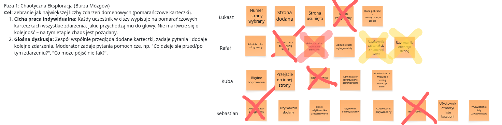

# Dokumentacja Warsztatu Event Storming - Telegazeta

## I. Wprowadzenie i Kontekst

* **Metodyka**: Event Storming

* **Cel Sesji:** Zrozumienie, zamodelowanie i uporządkowanie logiki biznesowej wybranego obszaru domenowego. Celem było zebranie zdarzeń, ułożenie ich chronologicznie, wzbogacenie kontekstem i wstępne zdefiniowanie granic systemu.

* **Data Warsztatu:** 27.11.2025

* **Uczestnicy (Aktorzy, Faza 1):** Łukasz Szenkiel, Rafał Wilczewski, Jakub Grzymisławski, Sebastian Górski.
  
  

---

## II. Fazy Warsztatu i Legenda

### A. Fazy Realizacji

1. **Faza 1: Chaotyczna Eksploracja (Burza Mózgów):** Zebrano Zdarzenia Domenowe (pomarańczowe karteczki).
2. **Faza 2: Uporządkowanie na Osi Czasu:** Ułożenie zebranych zdarzeń w porządku chronologicznym, opowiedzenie historii i odkrycie alternatywnych ścieżek.
3. **Faza 3: Wzbogacanie Mapy:** Dodanie kontekstu za pomocą kolorowych karteczek (Polecenia, Aktorzy, Reguły, Pytania).
4. **Faza 4: Podsumowanie i Kolejne Kroki:** Przegląd mapy, analiza wąskich gardeł i definiowanie granic kontekstów.

### B. Legenda Elementów Domeny

| Kolor                | Element                        | Opis                                                                        |
|:-------------------- |:------------------------------ |:--------------------------------------------------------------------------- |
| **Pomarańczowy**     | **Zdarzenie Domenowe (Event)** | Coś, co się wydarzyło w systemie.                                           |
| **Niebieski**        | **Polecenie (Command)**        | Żądanie (przed zdarzeniem), które je wywołało.                              |
| **Żółty**            | **Aktor/Agregat**              | Kto wykonuje dane polecenie (Aktor) lub byt, który zbiera logikę (Agregat). |
| **Różowy**           | **Reguła/Polityka (Policy)**   | Procesy, które dzieją się automatycznie.                                    |
| **Różowy (Parking)** | **Pytanie (Question)**         | Wątpliwości do dalszej dyskusji.                                            |

  

---

## III. Wyniki Modelowania Domeny

### A. Główny Przepływ (Sekwencja Zdarzeń - Przykłady)

Poniżej przedstawiono kluczowy, chronologiczny przepływ na mapie:

| Krok   | Agregat/Aktor | Polecenie (Command)              | Zdarzenie (Event)          | Reguła (Policy)                          |
|:------ |:------------- |:-------------------------------- |:-------------------------- |:---------------------------------------- |
| **1.** | Użytkownik    | `Utwórz użytkownika`             | `Użytkownik utworzony`     | Zmień status konta na `Aktywny`          |
| **2.** | (System)      | `Wyślij potwierdzenie`           | `Potwierdzenie wysłane`    |                                          |
| **3.** | Użytkownik    | `Potwierdź adres email`          | `Adres email potwierdzony` |                                          |
| **4.** | (System)      | `Przygotuj formularz`            | `Przygotowanie zakończone` |                                          |
| **5.** | Użytkownik    | `Przygotuj dokumenty do nadania` | `Dokumenty przygotowane`   | Wyślij powiadomienie do działu logistyki |
| **6.** | (System)      | `Dokumenty nadane`               | `Wypożyczenie rozpoczęte`  |                                          |

* *Dodatkowy przepływ (Katalog):* Aktor `Strona dodana` wywołuje Zdarzenie `Strona dodana`, a następnie zapisywane są `Właściwości strony zapisane`.

### B. Wstępne Granice Kontekstów Ograniczonych (Bounded Contexts)

Zidentyfikowane i pogrupowane logiczne moduły, które posłużą jako podstawa architektury:

1. **Zarządzanie Kontem/Rejestracja:** Odpowiada za procesy związane z tworzeniem konta użytkownika i jego autoryzacją.
   
   * *Kluczowe Eventy:* `Użytkownik utworzony`, `Adres email potwierdzony`.

2. **Wypożyczenia:** Odpowiada za proces przygotowania, nadania i rozpoczęcia wypożyczenia.
   
   * *Kluczowe Eventy:* `Dokumenty przygotowane`, `Wypożyczenie rozpoczęte`.

3. **Katalog/Zarządzanie Stronami:** Odpowiada za zarządzanie danymi statycznymi lub produktowymi.
   
   * *Kluczowe Eventy:* `Strona dodana`, `Właściwości strony zapisane`.
   
   

---

## IV. Wnioski i Następne Kroki

### A. Parking (Pytania do dyskusji)

Zidentyfikowane wątpliwości/problemy wymagające przedyskutowania i rozstrzygnięcia:

* **Użytkownicy:** Będą inni użytkownicy poza podstawowym klientem?
* **Statystyki/Kategorie:** Czy nadamy statystyki do kategorii (np. strony 180, 200...)?
* **Administracja:** Czy administrator może sam zrestartować hasło?
* **Uprawnienia:** Czy powinna być rola *superadmin*?
* **Logowanie:** Czy procesem rejestracji/logowania potrzebujemy się logować?

### B. Kolejne Działania

**Rozstrzygnięcie Parkingu:** Omówienie i podjęcie decyzji w sprawie wszystkich pytań zebranych w "parkingu".
**Dokumentacja:** Stworzona mapa jest doskonałą podstawą do tworzenia **backlogu produktu**, **projektowania architektury** i **pisania dokumentacji**.
**Projektowanie Architektury:** Wykorzystanie granic kontekstów do definicji usług lub modułów.

  
