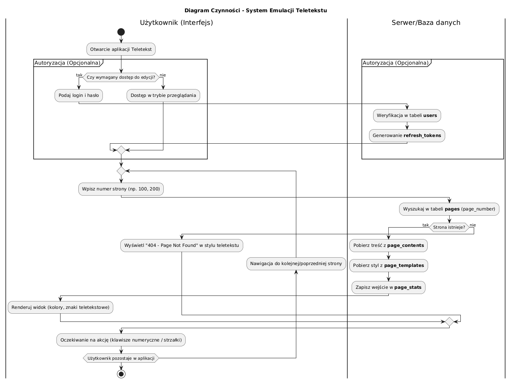
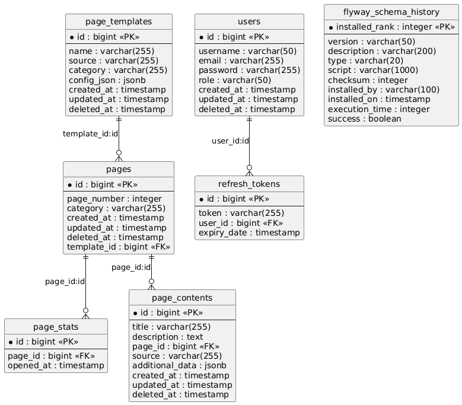
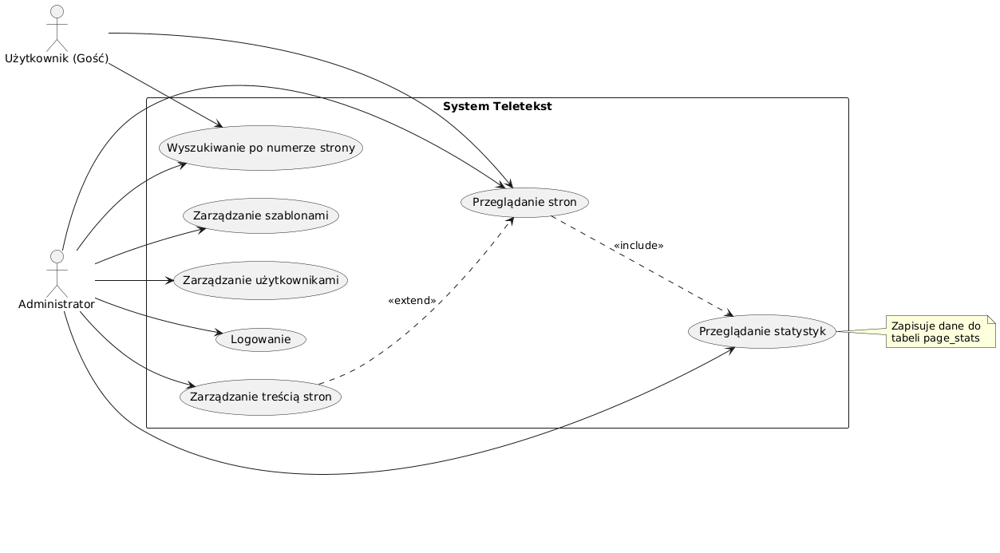

# Architektura Systemu

## Model Architektoniczny
Aplikacja została zbudowana zgodnie z wzorcem **MVC (Model-View-Controller)**. Zapewnia to wyraźną separację logiki biznesowej od warstwy prezentacji, co ułatwia rozwój i testowanie systemu.

## Stos Technologiczny
* **Backend:** Java 21, Spring Boot 3.5.6
* **Frontend:** HTML5, CSS, React 19
* **Baza danych:** PostgreSQL (główny magazyn danych).
* **Cache:** Redis 7.4.2-alpine (przechowywanie danych tymczasowych i sesyjnych).
* **Zarządzanie migracjami:** Flyway 10.20.1 (wersjonowanie schematu bazy).
* **Serwer proxy:** nginx 1.29

## Kluczowe Diagramy
##### Diagram czynności
Diagram ilustruje przebieg procesów takich jak tworzenie strony telegazety czy logowanie.
  
##### Diagram encji 
Diagram przedstawia strukturę bazy danych systemu telegazety.
  
##### Diagram przypadków użycia 
Diagram ukazuje interakcje u»ytkowników z systemem, identyfikując główne
funkcje dostępne w aplikacji.

