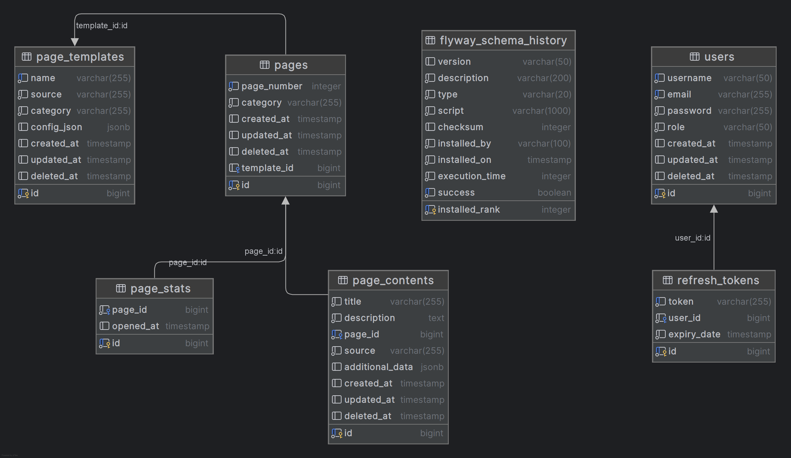

# Model bazy danych

## Charakterystyka ogólna
System **Teletext** wykorzystuje relacyjną bazę danych **PostgreSQL 17.2**. Wybór ten podyktowany był potrzebą zapewnienia pełnej spójności danych (ACID), wsparcia dla zaawansowanych typów tekstowych oraz łatwej integracji z frameworkiem Spring Boot poprzez Hibernate/JPA.

## Struktura danych i kluczowe encje

Baza danych została podzielona na logiczne obszary odpowiedzialne za treść, administrację oraz analitykę. Poniżej znajduje się opis najważniejszych tabel:

### 1. Zarządzanie treścią (Pages & Categories)
* **Strony telegazety (`pages`):** Główna tabela systemu. Przechowuje unikalny numer strony (klucz główny), tytuł, treść tekstową oraz meta-dane. Treść wspiera znaki specjalne i grafikę ASCII.
* **Kategorie (`categories`):** Słownik pozwalający na grupowanie stron (np. Sport, Gospodarka). Każda strona jest przypisana do jednej kategorii, co optymalizuje proces wyszukiwania i filtrowania treści.

### 2. Automatyzacja i Integracje (`integrations`)
* **Integracje zewnętrzne:** Tabela przechowująca konfigurację dla modułów automatycznych. Definiuje ona typ integracji (np. API pogodowe, wyniki giełdowe) oraz mapuje pobrane dane na konkretne numery stron telegazety. Dzięki temu system może bezobsługowo aktualizować treści w czasie rzeczywistym.

### 3. Bezpieczeństwo i Uprawnienia (`users`)
* **Użytkownicy i Role:** Tabela przechowująca dane dostępowe administratorów i redaktorów. System ról (Spring Security) definiuje zakres uprawnień – od możliwości podglądu statystyk po pełną edycję struktury stron i zarządzanie integracjami.

### 4. Analityka i Wydajność
* **Statystyki odwiedzin (`statistics`):** Rejestruje zdarzenia wyświetlenia poszczególnych stron. Dane te służą do generowania raportów popularności w panelu administratora.
* **Warstwa Cache (Redis):** Mimo że Redis nie jest bazą relacyjną, stanowi integralną część modelu danych jako magazyn typu klucz-wartość. Przechowuje on zserializowane obiekty stron, co znacząco odciąża PostgreSQL przy dużym natężeniu ruchu.

## Zarządzanie schematem
Integralność struktury bazy danych jest utrzymywana przez narzędzie **Flyway 10.20.1**. Wszystkie zmiany w modelu (tworzenie tabel, dodawanie kolumn) są wprowadzane poprzez skrypty migracyjne SQL, co zapewnia identyczną strukturę bazy na każdym środowisku uruchomieniowym.

